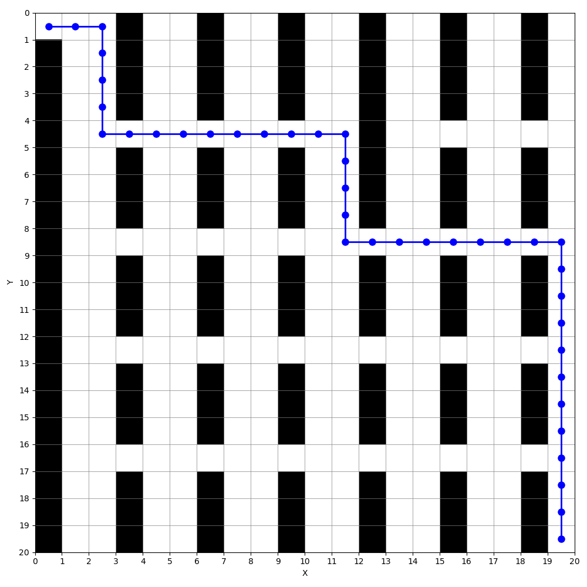
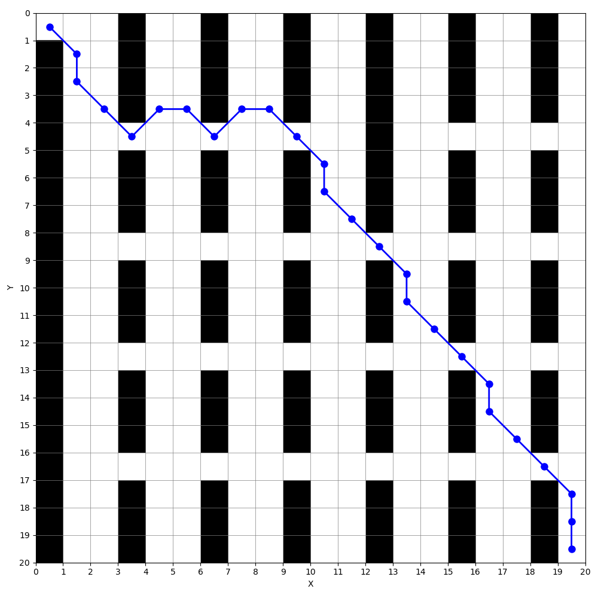
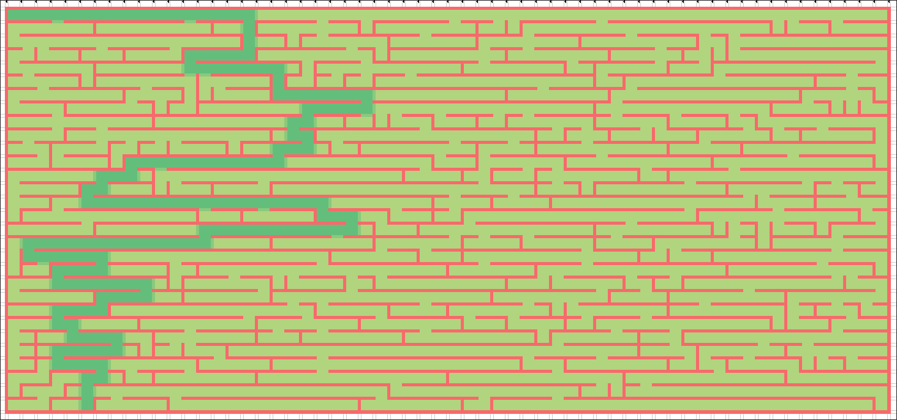
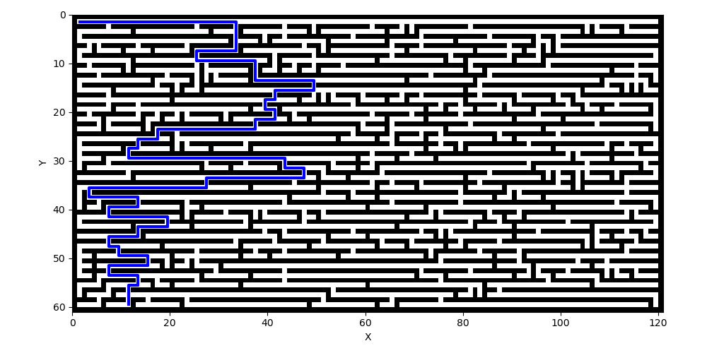

### Алгоритм Дейкстры:
1. Добавляем в очередь с приоритетом стартовую вершину, в качетстве приоритета берем 0 - длина кратчайшего пути до нее. $d[s] = 0$. Далее в цикле:
2. Выбираем вершину $u$ с минимальным приоритетом, т. е. с минимальным расстоянием до нее, и убираем ее из очереди.
3. Для всех соседей $v$ относительно вершины $u$ вычисляем: $d[v] = \min(d[v], d[u]+\omega(u,v))$, где $\omega(u,v)$ - расстояние между вершинами. Если $d[v]$ изменился, сохраняем вершину $u$ в качестве предыдущей для $v$, а также добавляем ее в очередь заново с другим приоритетом (старую запись в очереди не удаляем, т. к. это невозможо сделать быстро для очереди с приоритетом). При следующих итерациях старые записи будут игнорироваться по условию: приоритет u > d[u]. 
4. Если очередь пуста или из нее была удалена финишная вершина, то итерации прекращаются.
5. Восстанавливаем путь рекурсивно через prev[u].

Асимптотическая сложность: $O((V+E) \log V)$, где V - число вершин, E - число ребер. 
### Время работы для различных размеров  поля (первое - проход по диагоналям запрещен, второе - проход по диагоналям разрешен):
* 20x20: 0 мс, 1 мс
* 200x200: 49 мс, 73 мс
* 2000x2000: 5118 мс, 5988 мс
* 2000x20000: 37736 мс, 46753 мс
* Для поля 20000x20000 не хватает памяти.
### Найденные пути для поля 20x20:

Длина пути: 38 (39 вершин)

Длина пути: 30.3848 (26 вершин)

Видим, что если проход по диагоналям не разрешен, то длина пути всегда будет равной $n + m - 2$, где $n$ и $m$ - размеры поля. Возможность прохода по диагонали существенно сокращает ее.

### Поиск пути в лабиринте

Путь, найденный с помощью Flood-Fill Maze Solving Algorithm из https://github.com/s0lly/MazesInExcel.

Путь, найденный с помощью алгоритма Дейкстры (Время работы: 2 мс).

### Метод оптимизации расчетов:
Для задач, имеющих физическую интерпретацию, например, поиск пути на карте или сетке, можно добавить в приоритет эвристическую функцию: $\text{priority} = d[v] + h(v)$. $h(v)$ не должна переоценивать реальное расстояние, иначе алгоритм не будет работать. В качестве нее можно взять евклидово расстояние от вершины до финиша или другую норму.

Такой вариант алгоритма поиска пути называется A-star и именно он чаще используется в реальных задачах, т. к. добавление эвристики позволяет сильно сократить число рассматриваемых вершин, что позвляет уменьшить и требуемую память, и время работы. 
